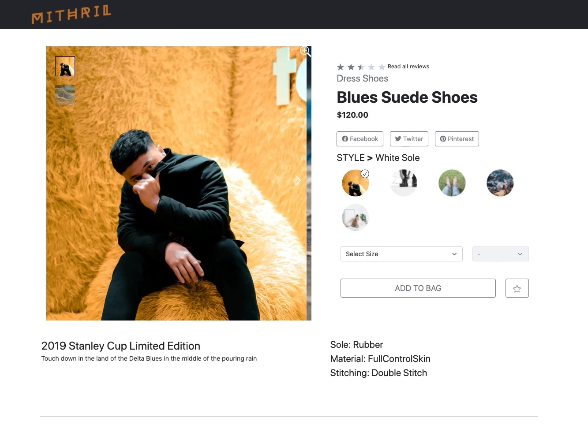

# Mithril

## Table of Contents

- [Table of Contents](#table-of-contents)
- [Description](#description)
- [Installation](#installation)
- [Usage](#usage)
- [Related Projects](#related-projects)
- [Team Members](#team-members)
- [Roadmap](#roadmap)
- [License](#license)

## Description



Mithril is a single-page web application for browsing, purchasing, and providing feedback on stylish modern clothing. The site has a React-based front-end.  My specific contribution was implementing the "related items" component, which displays as a carousel; each item can be compared with the main product above in the overview component, and when an item is selected it becomes the main product.


# Technologies

|                             Front-End                              |                                                                                                   Back-End                                                                                                    |                              Hosting                               |
| :----------------------------------------------------------------: | :-----------------------------------------------------------------------------------------------------------------------------------------------------------------------------------------------------------: | :----------------------------------------------------------------: |
|  |  |  |

## Installation

After forking the repo and cloning to local machine, follow these steps to install.

1. Run `npm install` to download dependencies.
2. You will need to set up a `.env` configuration file with a private GITHUB Authentication Token in the following form in your root directory.

```js
TOKEN = YOUR_KEY_HERE;
```

3. Please provide your own SSL encryption key and certificate files or follow this [link](https://stackoverflow.com/questions/10175812/how-to-create-a-self-signed-certificate-with-openssl) to produce your own. Please name them `key.pem` and `cert.pem` in your root directory.

## Usage

Follow below directions for testing, development, and production.

### Development

- Run `npm run start` to bundle the current files and watch for changes.
- Run `npm run server` to spin up the server and watch for files changes.

### Deployment

- Run `npm run build` to bundle the files once.
- Run `node server.js` to start up the server

## Team Members

- [Matthew Budiman](https://github.com/mattBman23)
- [Jason Fleming](https://github.com/jfleming9357)
- [Cayla Cardiff](https://github.com/cayla-c)
- [Daniel He](https://github.com/daniel-he-dev)

## License

MIT License
